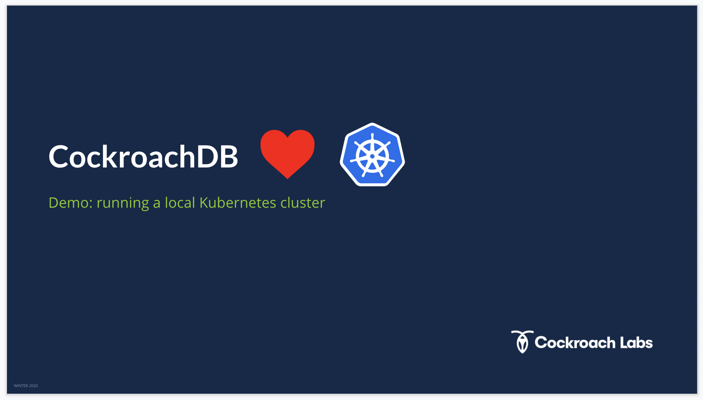

# Local Kubernetes Example
The following steps will install Kubernetes locally and configure a 3 node CockroachDB cluster using Helm.  For more information please refer to our official documentation [here](https://www.cockroachlabs.com/docs/stable/orchestrate-a-local-cluster-with-kubernetes-insecure.html).

## Prerequisites
Before getting started make sure the following tools are installed.

* [Homebrew](https://brew.sh) - a package manager for macOS
* [VirtualBox](https://www.virtualbox.org) _or_ [VMware Fusion](https://www.vmware.com/products/fusion/fusion-evaluation.html)
* [Kubectl](https://kubernetes.io/docs/setup/minikube/) - Kubernetes command-line tool
* [Minikube](https://kubernetes.io/docs/setup/minikube/) - Minikube runs a single-node Kubernetes cluster inside a Virtual Machine (VM) 
* [Helm](https://helm.sh/) - the package manager for Kubernetes

### Homebrew
```bash
/usr/bin/ruby -e "$(curl -fsSL https://raw.githubusercontent.com/Homebrew/install/master/install)"
```
reference: https://brew.sh/

### VirtualBox
```bash
brew cask install virtualbox
```

### Kubectl
```bash
brew install kubernetes-cli
```
reference: https://kubernetes.io/docs/tasks/tools/install-kubectl/#install-with-homebrew-on-macos

### Minikube
Install Minikube...
```bash
brew install minikube
```

### Helm
Install Helm...
```bash
brew install helm
```
reference: https://helm.sh/docs/intro/install/#from-homebrew-macos

### Start up Minikube
Then start the service... (using VMware Fusion here)
```bash
export PATH=/usr/local/bin:$PATH ; minikube start --cpus 4 --memory 8192 --driver=vmware
```
reference: https://kubernetes.io/docs/tasks/tools/install-minikube/#install-minikube

## Installing and Running CockroachDB
Add the official `CockroachDB` chart repository:
```bash
helm repo add cockroachdb https://charts.cockroachdb.com/
```

Update your `helm` repo to ensure you are pulling the latest version of CockroachDB
```bash
helm repo update
```

Initialize `helm` (to avoid `Error: could not find tiller` during subsequent steps)
```bash
helm init
```

You can use `helm` to install either a `secure` or `insecure` cluster.  Instructions differ slightly for each.

* [Secure](SECURE.md) 
* [Insecure](INSECURE.md)

## Explore the CockroachDB UI
In a new tab, run port forwarding so you can access the CockroachDB UI
```bash
kubectl port-forward k8demo-cockroachdb-0 8080
```

If you've run this correctly, the output should look like this:
```bash
Forwarding from 127.0.0.1:8080 -> 8080
Forwarding from [::1]:8080 -> 8080
```

With additional lines showing when you go to port `8080` in the browser.

This will take over your terminal window, and you'll need to open a new tab to run the next shell command.

Open the CockroachDB UI in your browser: [http://localhost:8080](http://localhost:8080)

## Create and Run TPCC

Create a the `tpcc` workload on the cluster...
```bash
# insecure cluster
kubectl run workload-init -it --image=cockroachdb/cockroach:latest --rm --restart=Never -- workload init tpcc --warehouses=3 'postgresql://root@k8demo-cockroachdb-public:26257?sslmode=disable&ApplicationName=tpcc'

# secure cluster
kubectl exec -it cockroachdb-client-secure -- ./cockroach workload init tpcc --warehouses=3 'postgres://root@k8demo-cockroachdb-public:26257?sslmode=verify-full&ApplicationName=tpcc&sslrootcert=/cockroach-certs/ca.crt&sslcert=/cockroach-certs/client.root.crt&sslkey=/cockroach-certs/client.root.key'
```

If run correctly, there will be no output.

then run the workload...
```bash
# insecure cluster
kubectl run workload-run -it --image=cockroachdb/cockroach:latest --rm --restart=Never -- workload run tpcc --warehouses=3 --tolerate-errors --duration=10m 'postgresql://root@k8demo-cockroachdb-public:26257?sslmode=disable&ApplicationName=tpcc'

# secure cluster
kubectl exec -it cockroachdb-client-secure -- ./cockroach workload run tpcc --warehouses=3 --tolerate-errors --duration=10m 'postgres://root@k8demo-cockroachdb-public:26257?sslmode=verify-full&ApplicationName=tpcc&sslrootcert=/cockroach-certs/ca.crt&sslcert=/cockroach-certs/client.root.crt&sslkey=/cockroach-certs/client.root.key'
```
reference: See https://www.cockroachlabs.com/docs/stable/cockroach-workload.html#tpcc-workload

This will take over your terminal for 10 minutes, so you'll need to open a new tab for the next command.


## Kill a Node
```bash
kubectl delete pod k8demo-cockroachdb-2
```

If this command works, then `pod "k8demo-cockroachdb-2" deleted` will be displayed.

Note that on the overview page of your dashboard, at [http://localhost:8080/#/overview/list](http://localhost:8080/#/overview/list), and the node will be automatically be restarted by Kubernetes shortly.

If you keep an eye on the admin console, you will see the node restart within a few minutes.


## Add a Node
```bash
kubectl scale statefulset k8demo-cockroachdb --replicas=4
```

If this runs correctly, the shell will print `statefulset.apps "k8demo-cockroachdb" scaled`.

After a few seconds, you can refresh the admin UI to see the new node.

## Appendix

### Open the Dashboard
Running this command opens the `minikube` dashboard in a browser window
```bash
minikube dashboard
```

### Open Bash Shell to Node
```bash
kubectl exec -it k8demo-cockroachdb-0 -- bash
```

### Check Logs
```bash
kubectl logs k8demo-cockroachdb-2 | less
```

Use the `q` key to exit.

### Open SQL Client
```bash
# insecure cluster
kubectl run sql-client -it --image=cockroachdb/cockroach:latest --rm --restart=Never -- sql --insecure --host=k8demo-cockroachdb-public

# secure cluster
kubectl exec -it cockroachdb-client-secure -- ./cockroach sql --certs-dir=/cockroach-certs --host=k8demo-cockroachdb-public
```

Use `ctrl-d` or `exit` to exit the SQL shell.

### Cleaning up

When you're ready to clean up your test environment, run the following:

Stop the `kubectl` process (`control-c` will work, as will closing the terminal window).

Run the following to purge the installation of CockroachDB with helm:
```bash
helm delete k8demo
```

Stop the `minikube` environment:
```bash
minikube stop
```

... and/or delete it with
```bash
minikube delete
```

